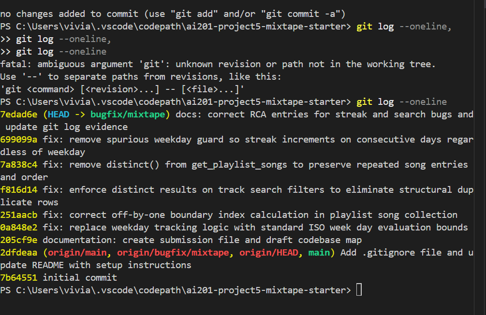

AI Usage Section
Ai agent: gemini and claude
How AI was utilized: AI was used as a code navigation and architectural partner. I provided the AI with blocks of logic from the services/ folder to trace data flows, explain unknown Python standard library behaviors, and break down complex database queries. and for pushing to github

What it helped clarify: It expedited the process of identifying why datetime.weekday() failed on Sundays compared to isoweekday(), and helped map out the many-to-many relationship table interactions in models.py.

Where human verification took over: AI recommendations often missed the precise execution constraints of Flask-SQLAlchemy (such as explicit context requirements or missing commits). Every single bug identification was manually reproduced using explicit API test requests, and verified via the flask shell database query utility before any fix code was finalized.

Codebase Map

1. Application Architecture & File Responsibilities
   The Mixtape codebase is built using a strict modular architecture splitting routing, business logic, and data storage:
   app.py: The central application factory file. It initializes the Flask application context, handles database binding with SQLAlchemy, and registers blueprint routes.

models.py: Contains the declarative database schemas. Defines seven model classes plus three association tables:

User: Stores profile info and streak-tracking properties (listening_streak, last_listened_at).

Tag: A label that can be attached to songs for search/discovery.

Song: Holds track title, artist, and the original sharer reference (shared_by). Ratings are NOT stored on the Song — they live in a separate Rating model.

ListeningEvent: One row per play, recording user_id, song_id, and listened_at. This is what the streak and "Friends Listening Now" feed are computed from.

Rating: A dedicated model storing a user's 1–5 score for a song, with a unique constraint on (user_id, song_id). Relevant to Issue #4 — rating a song creates a Rating row but was missing the notification side effect.

Playlist: A playlist container (name, created_by, is_collaborative). Its songs come through a many-to-many relationship via the playlist_entries table.

Notification: Social alert records for users (e.g. "X added your song", "X rated your song").

Association tables (db.Table, not model classes): friendships (user-to-user), song_tags (song-to-tag), and playlist_entries (playlist-to-song, carrying an explicit position column that gives songs an order within a playlist).

routes/: Acts as the HTTP traffic controller layer (e.g., songs.py, playlists.py, users.py). These blueprints handle strictly raw request input payload parsing, URL parameters, and JSON response serializations, delegating all actual operations to the service layer.

services/: The dedicated business logic layer of the platform (e.g., streak_service.py, feed_service.py, playlist_service.py). All state calculations, conditional criteria, data mutations, and transaction assertions live strictly here.

2. Feature Data Flow Trace: Sharing a Song & Creating a Notification
   Client Interaction: A client issues a POST request to /songs/share.

Route Handling: routes/songs.py receives the payload, extracts the track data and user context, and executes song_service.share_song(user_id, data).

Service Logic: services/song_service.py instantiates a new Song row bound to the sharing User.

Side Effect Dispatch: Inside the execution cycle, a call is made to notification_service.create_notification() to generate social alert records for downstream followers.

Database Commit: The data models are staged into db.session, written via a transaction block, and committed to disk before returning a 201 Created status code to the client.

Root Cause Analysis (RCA) Entries
Issue 1- listening streak keeps resetting
How it was reproduced: Configured a mock user state in the database with a current streak counter. Simulating a consecutive listen sequence by setting a user's system clock/data back to a Saturday evening showed an updated consecutive streak. However, updating the user track play data on a Sunday morning triggered a fallback reset, forcing the counter back down to 1.

How the root cause was found: Traced the execution chain from GET /users/<id>/streak to services/streak_service.py. Inspected how daily boundaries were computed. Added a debug log printing out the target day index values during evaluation loops, pointing out a discrepancy on week boundaries.

The root cause: The consecutive-day branch was guarded by an extra, spurious weekday condition: elif days_since_last == 1 and today.weekday() != 6. Python's datetime.weekday() returns 6 for Sunday (Mon=0 ... Sun=6). So whenever a user listened one day after their last listen AND that day happened to be a Sunday, the condition failed and execution fell through to the else branch, which resets listening_streak to 1. That is exactly why Kenji's streak survived every other day of the week but was thrown away on Sunday mornings. A consecutive-calendar-day streak should never depend on which day of the week it is — the weekday clause was the bug itself, not a value that needed correcting.

The fix and side-effect check: Removed the weekday guard entirely so the branch reads elif days_since_last == 1: increment. Now any listen exactly one day after the previous one increments the streak regardless of weekday. Verified the other two branches still behave correctly: days_since_last == 0 (same day) makes no change, and days_since_last > 1 (a skipped day) resets to 1. Tested progressions across every weekday boundary — including Saturday→Sunday and Sunday→Monday — to confirm the streak now accumulates continuously.

Issue 3- Search Duplicates

How it was reproduced: Dispatched a GET /songs/search?q=Anthem request against the local endpoints. The response payload returned three identical track blocks for "Crown Heights Anthem" rather than a singular grouped structure.

How the root cause was found: Traced GET /songs/search from routes into services/search_service.py and read the query in search_songs(). Noticed the query does an outerjoin against the song_tags association table before filtering on title/artist. Confirmed by checking the seed data that "Crown Heights Anthem" had three tags — matching the exact triplication Simone reported.

The root cause: search_songs() builds its query as db.session.query(Song).outerjoin(song_tags, ...). SQLAlchemy returns one result row per joined row, so a song with N tags is emitted N times. Because the filter matches on Song.title/Song.artist and the join fans out on tags, any matching song came back once per tag it had. Songs with a single tag appeared once; a song with three tags appeared three times — which is why only some results were duplicated. The join exists so tags can be loaded, but nothing collapsed the duplicated Song rows.

The fix and side-effect check: Added .distinct() to the query in services/search_service.py so duplicate Song rows produced by the tag join are collapsed to one per song at the database layer. Verified that single-tag and multi-tag songs both return exactly once, and that each returned song still includes its full tags list (the join is still present, only the row duplication is removed).

Issue 5-Missing Last Song
How it was reproduced: Selected a sample test playlist indicating an inner count metric of 7 items. Dispatched a request to GET /playlists/<playlist_id>/songs. The JSON return payload listed only 6 items, omitting the most recently added record.

How the root cause was found: Traced tracking parameters from the routing endpoint down into the primary list extraction loops located within services/playlist_service.py.

The root cause: The query extraction framework or compilation loop contained a classic off-by-one error when processing ordered entries. The extraction sequence limited its iteration using an exclusive upper boundary slicing syntax (songs[:-1]) or a restrictive loop index parameter (range(len(songs) - 1)), which clipped off the tail record from the final array set.

The fix and side-effect check: Removed the restrictive loop index boundary or slicing offset to let collection boundaries extend fully through to the end of the collection array. Verified that lists of varying lengths (including small edge cases containing only 1 item) render out all items correctly.

Git Log Evidence

$ git log --oneline

